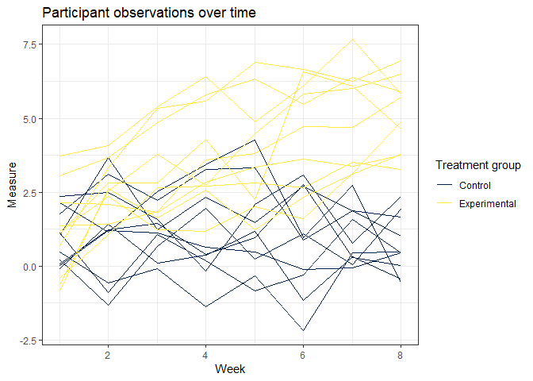

P8105 Homework 5
================
Stephanie Izard

Problem 1
---------

#### Creating dataframe:

-   Step 1: Creating a string containing all file names

``` r
file_names <- list.files(path = "./data/q1/", full.names = TRUE)
```

-   Step 2: Iterating over file names, reading in data for each subject

``` r
read_ppt_info <- function(file_names) {
  z = read_csv(file_names)
  z
}

ppt_info <- file_names %>% 
  tibble(file_name = .) %>% 
  group_by(file_name) %>% 
  nest() %>% 
  mutate(data = map(.$file_name, read_ppt_info)) %>% 
  unnest()
```

    ## Parsed with column specification:
    ## cols(
    ##   week_1 = col_double(),
    ##   week_2 = col_double(),
    ##   week_3 = col_double(),
    ##   week_4 = col_double(),
    ##   week_5 = col_double(),
    ##   week_6 = col_double(),
    ##   week_7 = col_double(),
    ##   week_8 = col_double()
    ## )
    ## Parsed with column specification:
    ## cols(
    ##   week_1 = col_double(),
    ##   week_2 = col_double(),
    ##   week_3 = col_double(),
    ##   week_4 = col_double(),
    ##   week_5 = col_double(),
    ##   week_6 = col_double(),
    ##   week_7 = col_double(),
    ##   week_8 = col_double()
    ## )
    ## Parsed with column specification:
    ## cols(
    ##   week_1 = col_double(),
    ##   week_2 = col_double(),
    ##   week_3 = col_double(),
    ##   week_4 = col_double(),
    ##   week_5 = col_double(),
    ##   week_6 = col_double(),
    ##   week_7 = col_double(),
    ##   week_8 = col_double()
    ## )
    ## Parsed with column specification:
    ## cols(
    ##   week_1 = col_double(),
    ##   week_2 = col_double(),
    ##   week_3 = col_double(),
    ##   week_4 = col_double(),
    ##   week_5 = col_double(),
    ##   week_6 = col_double(),
    ##   week_7 = col_double(),
    ##   week_8 = col_double()
    ## )
    ## Parsed with column specification:
    ## cols(
    ##   week_1 = col_double(),
    ##   week_2 = col_double(),
    ##   week_3 = col_double(),
    ##   week_4 = col_double(),
    ##   week_5 = col_double(),
    ##   week_6 = col_double(),
    ##   week_7 = col_double(),
    ##   week_8 = col_double()
    ## )
    ## Parsed with column specification:
    ## cols(
    ##   week_1 = col_double(),
    ##   week_2 = col_double(),
    ##   week_3 = col_double(),
    ##   week_4 = col_double(),
    ##   week_5 = col_double(),
    ##   week_6 = col_double(),
    ##   week_7 = col_double(),
    ##   week_8 = col_double()
    ## )
    ## Parsed with column specification:
    ## cols(
    ##   week_1 = col_double(),
    ##   week_2 = col_double(),
    ##   week_3 = col_double(),
    ##   week_4 = col_double(),
    ##   week_5 = col_double(),
    ##   week_6 = col_double(),
    ##   week_7 = col_double(),
    ##   week_8 = col_double()
    ## )
    ## Parsed with column specification:
    ## cols(
    ##   week_1 = col_double(),
    ##   week_2 = col_double(),
    ##   week_3 = col_double(),
    ##   week_4 = col_double(),
    ##   week_5 = col_double(),
    ##   week_6 = col_double(),
    ##   week_7 = col_double(),
    ##   week_8 = col_double()
    ## )
    ## Parsed with column specification:
    ## cols(
    ##   week_1 = col_double(),
    ##   week_2 = col_double(),
    ##   week_3 = col_double(),
    ##   week_4 = col_double(),
    ##   week_5 = col_double(),
    ##   week_6 = col_double(),
    ##   week_7 = col_double(),
    ##   week_8 = col_double()
    ## )
    ## Parsed with column specification:
    ## cols(
    ##   week_1 = col_double(),
    ##   week_2 = col_double(),
    ##   week_3 = col_double(),
    ##   week_4 = col_double(),
    ##   week_5 = col_double(),
    ##   week_6 = col_double(),
    ##   week_7 = col_double(),
    ##   week_8 = col_double()
    ## )
    ## Parsed with column specification:
    ## cols(
    ##   week_1 = col_double(),
    ##   week_2 = col_double(),
    ##   week_3 = col_double(),
    ##   week_4 = col_double(),
    ##   week_5 = col_double(),
    ##   week_6 = col_double(),
    ##   week_7 = col_double(),
    ##   week_8 = col_double()
    ## )
    ## Parsed with column specification:
    ## cols(
    ##   week_1 = col_double(),
    ##   week_2 = col_double(),
    ##   week_3 = col_double(),
    ##   week_4 = col_double(),
    ##   week_5 = col_double(),
    ##   week_6 = col_double(),
    ##   week_7 = col_double(),
    ##   week_8 = col_double()
    ## )
    ## Parsed with column specification:
    ## cols(
    ##   week_1 = col_double(),
    ##   week_2 = col_double(),
    ##   week_3 = col_double(),
    ##   week_4 = col_double(),
    ##   week_5 = col_double(),
    ##   week_6 = col_double(),
    ##   week_7 = col_double(),
    ##   week_8 = col_double()
    ## )

    ## Parsed with column specification:
    ## cols(
    ##   week_1 = col_double(),
    ##   week_2 = col_double(),
    ##   week_3 = col_double(),
    ##   week_4 = col_double(),
    ##   week_5 = col_double(),
    ##   week_6 = col_double(),
    ##   week_7 = col_integer(),
    ##   week_8 = col_double()
    ## )

    ## Parsed with column specification:
    ## cols(
    ##   week_1 = col_double(),
    ##   week_2 = col_double(),
    ##   week_3 = col_double(),
    ##   week_4 = col_double(),
    ##   week_5 = col_double(),
    ##   week_6 = col_double(),
    ##   week_7 = col_double(),
    ##   week_8 = col_double()
    ## )
    ## Parsed with column specification:
    ## cols(
    ##   week_1 = col_double(),
    ##   week_2 = col_double(),
    ##   week_3 = col_double(),
    ##   week_4 = col_double(),
    ##   week_5 = col_double(),
    ##   week_6 = col_double(),
    ##   week_7 = col_double(),
    ##   week_8 = col_double()
    ## )
    ## Parsed with column specification:
    ## cols(
    ##   week_1 = col_double(),
    ##   week_2 = col_double(),
    ##   week_3 = col_double(),
    ##   week_4 = col_double(),
    ##   week_5 = col_double(),
    ##   week_6 = col_double(),
    ##   week_7 = col_double(),
    ##   week_8 = col_double()
    ## )
    ## Parsed with column specification:
    ## cols(
    ##   week_1 = col_double(),
    ##   week_2 = col_double(),
    ##   week_3 = col_double(),
    ##   week_4 = col_double(),
    ##   week_5 = col_double(),
    ##   week_6 = col_double(),
    ##   week_7 = col_double(),
    ##   week_8 = col_double()
    ## )
    ## Parsed with column specification:
    ## cols(
    ##   week_1 = col_double(),
    ##   week_2 = col_double(),
    ##   week_3 = col_double(),
    ##   week_4 = col_double(),
    ##   week_5 = col_double(),
    ##   week_6 = col_double(),
    ##   week_7 = col_double(),
    ##   week_8 = col_double()
    ## )
    ## Parsed with column specification:
    ## cols(
    ##   week_1 = col_double(),
    ##   week_2 = col_double(),
    ##   week_3 = col_double(),
    ##   week_4 = col_double(),
    ##   week_5 = col_double(),
    ##   week_6 = col_double(),
    ##   week_7 = col_double(),
    ##   week_8 = col_double()
    ## )

-   Step 3: Tidying the result

``` r
ppt_info <- ppt_info %>% 
  mutate(file_name = str_replace(file_name, "./data/q1/", ""),
         file_name = str_replace(file_name, ".csv", "")) %>% 
  rename(ppt_id = file_name) %>% 
  mutate(ppt_unique_id = c(1:20)) %>% 
  gather(key = "week", value = "measure", week_1:week_8) %>% 
  mutate(week = str_replace(week, ".*_", ""))
```

##### Spaghetti plot

``` r
ppt_info %>% 
  mutate(week = as.numeric(week)) %>%
  separate(col = ppt_id, into = c("treatment", "number"), by = "_") %>% 
  group_by(treatment, ppt_unique_id) %>% 
  ggplot(aes(x = week, y = measure, group = ppt_unique_id, color = treatment)) +
    geom_line() +
    labs(x = "Week", y = "Measure", title = "Participant observations over time") + 
    viridis::scale_color_viridis(option = "cividis", name = "Treatment group", discrete = TRUE, label = c("Control", "Experimental")) +
    theme_bw()
```



Comments: (on difference over time)

Problem 2
---------

#### Reading in the raw homicide data from the Washington Post

``` r
homicide_data <- read_csv("./data/homicide-data.csv") 
```

    ## Parsed with column specification:
    ## cols(
    ##   uid = col_character(),
    ##   reported_date = col_integer(),
    ##   victim_last = col_character(),
    ##   victim_first = col_character(),
    ##   victim_race = col_character(),
    ##   victim_age = col_character(),
    ##   victim_sex = col_character(),
    ##   city = col_character(),
    ##   state = col_character(),
    ##   lat = col_double(),
    ##   lon = col_double(),
    ##   disposition = col_character()
    ## )

About the raw data: (describe some stuff here)

#### Creating variables and nesting data

``` r
homicide_data <- homicide_data %>% 
  unite(city_state, city:state, sep = ", ", remove = FALSE) %>% 
  mutate(case_status = if_else(disposition == "Closed without arrest", "unsolved", 
                               if_else(disposition == "Open/No arrest", "unsolved", "solved"))) %>% 
  mutate(city_state = recode(city_state, "Tulsa, AL" = "Tulsa, OK")) %>% 
  group_by(city_state) %>% 
  nest()
```

#### Summarizing total and unsolved homicides

``` r
homicide_data_total <- homicide_data %>% 
  unnest() %>% 
  group_by(city_state) %>% 
  summarize(total_cases = n())

homicide_data_unsolved <- homicide_data %>% 
  unnest() %>% 
  filter(case_status == "unsolved") %>% 
  group_by(city_state) %>% 
  summarize(total_unsolved = n())

inner_join(homicide_data_total, homicide_data_unsolved, by = "city_state") %>% 
  rename("City" = city_state,
         "Total Homicides" = total_cases,
         "Unsolved Homicides" = total_unsolved) %>% 
  knitr::kable()
```

| City               |  Total Homicides|  Unsolved Homicides|
|:-------------------|----------------:|-------------------:|
| Albuquerque, NM    |              378|                 146|
| Atlanta, GA        |              973|                 373|
| Baltimore, MD      |             2827|                1825|
| Baton Rouge, LA    |              424|                 196|
| Birmingham, AL     |              800|                 347|
| Boston, MA         |              614|                 310|
| Buffalo, NY        |              521|                 319|
| Charlotte, NC      |              687|                 206|
| Chicago, IL        |             5535|                4073|
| Cincinnati, OH     |              694|                 309|
| Columbus, OH       |             1084|                 575|
| Dallas, TX         |             1567|                 754|
| Denver, CO         |              312|                 169|
| Detroit, MI        |             2519|                1482|
| Durham, NC         |              276|                 101|
| Fort Worth, TX     |              549|                 255|
| Fresno, CA         |              487|                 169|
| Houston, TX        |             2942|                1493|
| Indianapolis, IN   |             1322|                 594|
| Jacksonville, FL   |             1168|                 597|
| Kansas City, MO    |             1190|                 486|
| Las Vegas, NV      |             1381|                 572|
| Long Beach, CA     |              378|                 156|
| Los Angeles, CA    |             2257|                1106|
| Louisville, KY     |              576|                 261|
| Memphis, TN        |             1514|                 483|
| Miami, FL          |              744|                 450|
| Milwaukee, wI      |             1115|                 403|
| Minneapolis, MN    |              366|                 187|
| Nashville, TN      |              767|                 278|
| New Orleans, LA    |             1434|                 930|
| New York, NY       |              627|                 243|
| Oakland, CA        |              947|                 508|
| Oklahoma City, OK  |              672|                 326|
| Omaha, NE          |              409|                 169|
| Philadelphia, PA   |             3037|                1360|
| Phoenix, AZ        |              914|                 504|
| Pittsburgh, PA     |              631|                 337|
| Richmond, VA       |              429|                 113|
| Sacramento, CA     |              376|                 139|
| San Antonio, TX    |              833|                 357|
| San Bernardino, CA |              275|                 170|
| San Diego, CA      |              461|                 175|
| San Francisco, CA  |              663|                 336|
| Savannah, GA       |              246|                 115|
| St. Louis, MO      |             1677|                 905|
| Stockton, CA       |              444|                 266|
| Tampa, FL          |              208|                  95|
| Tulsa, OK          |              584|                 193|
| Washington, DC     |             1345|                 589|

#### Baltimore, MD: Proportion of unsolved homicides

``` r
md_only <- homicide_data %>% 
  unnest() %>% 
  filter(city_state == "Baltimore, MD")

prop.test(table(md_only$case_status)) %>% 
  broom::tidy() %>% 
  select(estimate, conf.low, conf.high) %>% 
  knitr::kable()
```

|   estimate|   conf.low|  conf.high|
|----------:|----------:|----------:|
|  0.3544393|  0.3368401|  0.3724375|

#### Plotting estimates and CIs for each city
