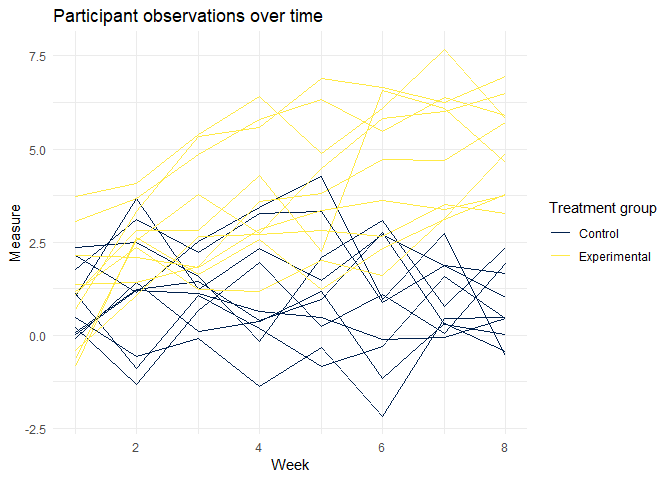

P8105 Homework 5
================
Stephanie Izard

Problem 1
---------

#### Creating dataframe:

-   Step 1: Creating a string containing all file names

``` r
file_names <- list.files(path = "./data/q1/", full.names = TRUE)
```

-   Step 2: Iterating over file names, reading in data for each subject

``` r
read_ppt_info <- function(file_names) {
  z = read_csv(file_names)
  z
}

ppt_info <- file_names %>% 
  tibble(file_name = .) %>% 
  group_by(file_name) %>% 
  nest() %>% 
  mutate(data = map(.$file_name, read_ppt_info)) %>% 
  unnest()
```

    ## Parsed with column specification:
    ## cols(
    ##   week_1 = col_double(),
    ##   week_2 = col_double(),
    ##   week_3 = col_double(),
    ##   week_4 = col_double(),
    ##   week_5 = col_double(),
    ##   week_6 = col_double(),
    ##   week_7 = col_double(),
    ##   week_8 = col_double()
    ## )
    ## Parsed with column specification:
    ## cols(
    ##   week_1 = col_double(),
    ##   week_2 = col_double(),
    ##   week_3 = col_double(),
    ##   week_4 = col_double(),
    ##   week_5 = col_double(),
    ##   week_6 = col_double(),
    ##   week_7 = col_double(),
    ##   week_8 = col_double()
    ## )
    ## Parsed with column specification:
    ## cols(
    ##   week_1 = col_double(),
    ##   week_2 = col_double(),
    ##   week_3 = col_double(),
    ##   week_4 = col_double(),
    ##   week_5 = col_double(),
    ##   week_6 = col_double(),
    ##   week_7 = col_double(),
    ##   week_8 = col_double()
    ## )
    ## Parsed with column specification:
    ## cols(
    ##   week_1 = col_double(),
    ##   week_2 = col_double(),
    ##   week_3 = col_double(),
    ##   week_4 = col_double(),
    ##   week_5 = col_double(),
    ##   week_6 = col_double(),
    ##   week_7 = col_double(),
    ##   week_8 = col_double()
    ## )
    ## Parsed with column specification:
    ## cols(
    ##   week_1 = col_double(),
    ##   week_2 = col_double(),
    ##   week_3 = col_double(),
    ##   week_4 = col_double(),
    ##   week_5 = col_double(),
    ##   week_6 = col_double(),
    ##   week_7 = col_double(),
    ##   week_8 = col_double()
    ## )
    ## Parsed with column specification:
    ## cols(
    ##   week_1 = col_double(),
    ##   week_2 = col_double(),
    ##   week_3 = col_double(),
    ##   week_4 = col_double(),
    ##   week_5 = col_double(),
    ##   week_6 = col_double(),
    ##   week_7 = col_double(),
    ##   week_8 = col_double()
    ## )
    ## Parsed with column specification:
    ## cols(
    ##   week_1 = col_double(),
    ##   week_2 = col_double(),
    ##   week_3 = col_double(),
    ##   week_4 = col_double(),
    ##   week_5 = col_double(),
    ##   week_6 = col_double(),
    ##   week_7 = col_double(),
    ##   week_8 = col_double()
    ## )
    ## Parsed with column specification:
    ## cols(
    ##   week_1 = col_double(),
    ##   week_2 = col_double(),
    ##   week_3 = col_double(),
    ##   week_4 = col_double(),
    ##   week_5 = col_double(),
    ##   week_6 = col_double(),
    ##   week_7 = col_double(),
    ##   week_8 = col_double()
    ## )
    ## Parsed with column specification:
    ## cols(
    ##   week_1 = col_double(),
    ##   week_2 = col_double(),
    ##   week_3 = col_double(),
    ##   week_4 = col_double(),
    ##   week_5 = col_double(),
    ##   week_6 = col_double(),
    ##   week_7 = col_double(),
    ##   week_8 = col_double()
    ## )
    ## Parsed with column specification:
    ## cols(
    ##   week_1 = col_double(),
    ##   week_2 = col_double(),
    ##   week_3 = col_double(),
    ##   week_4 = col_double(),
    ##   week_5 = col_double(),
    ##   week_6 = col_double(),
    ##   week_7 = col_double(),
    ##   week_8 = col_double()
    ## )
    ## Parsed with column specification:
    ## cols(
    ##   week_1 = col_double(),
    ##   week_2 = col_double(),
    ##   week_3 = col_double(),
    ##   week_4 = col_double(),
    ##   week_5 = col_double(),
    ##   week_6 = col_double(),
    ##   week_7 = col_double(),
    ##   week_8 = col_double()
    ## )
    ## Parsed with column specification:
    ## cols(
    ##   week_1 = col_double(),
    ##   week_2 = col_double(),
    ##   week_3 = col_double(),
    ##   week_4 = col_double(),
    ##   week_5 = col_double(),
    ##   week_6 = col_double(),
    ##   week_7 = col_double(),
    ##   week_8 = col_double()
    ## )
    ## Parsed with column specification:
    ## cols(
    ##   week_1 = col_double(),
    ##   week_2 = col_double(),
    ##   week_3 = col_double(),
    ##   week_4 = col_double(),
    ##   week_5 = col_double(),
    ##   week_6 = col_double(),
    ##   week_7 = col_double(),
    ##   week_8 = col_double()
    ## )

    ## Parsed with column specification:
    ## cols(
    ##   week_1 = col_double(),
    ##   week_2 = col_double(),
    ##   week_3 = col_double(),
    ##   week_4 = col_double(),
    ##   week_5 = col_double(),
    ##   week_6 = col_double(),
    ##   week_7 = col_integer(),
    ##   week_8 = col_double()
    ## )

    ## Parsed with column specification:
    ## cols(
    ##   week_1 = col_double(),
    ##   week_2 = col_double(),
    ##   week_3 = col_double(),
    ##   week_4 = col_double(),
    ##   week_5 = col_double(),
    ##   week_6 = col_double(),
    ##   week_7 = col_double(),
    ##   week_8 = col_double()
    ## )
    ## Parsed with column specification:
    ## cols(
    ##   week_1 = col_double(),
    ##   week_2 = col_double(),
    ##   week_3 = col_double(),
    ##   week_4 = col_double(),
    ##   week_5 = col_double(),
    ##   week_6 = col_double(),
    ##   week_7 = col_double(),
    ##   week_8 = col_double()
    ## )
    ## Parsed with column specification:
    ## cols(
    ##   week_1 = col_double(),
    ##   week_2 = col_double(),
    ##   week_3 = col_double(),
    ##   week_4 = col_double(),
    ##   week_5 = col_double(),
    ##   week_6 = col_double(),
    ##   week_7 = col_double(),
    ##   week_8 = col_double()
    ## )
    ## Parsed with column specification:
    ## cols(
    ##   week_1 = col_double(),
    ##   week_2 = col_double(),
    ##   week_3 = col_double(),
    ##   week_4 = col_double(),
    ##   week_5 = col_double(),
    ##   week_6 = col_double(),
    ##   week_7 = col_double(),
    ##   week_8 = col_double()
    ## )
    ## Parsed with column specification:
    ## cols(
    ##   week_1 = col_double(),
    ##   week_2 = col_double(),
    ##   week_3 = col_double(),
    ##   week_4 = col_double(),
    ##   week_5 = col_double(),
    ##   week_6 = col_double(),
    ##   week_7 = col_double(),
    ##   week_8 = col_double()
    ## )
    ## Parsed with column specification:
    ## cols(
    ##   week_1 = col_double(),
    ##   week_2 = col_double(),
    ##   week_3 = col_double(),
    ##   week_4 = col_double(),
    ##   week_5 = col_double(),
    ##   week_6 = col_double(),
    ##   week_7 = col_double(),
    ##   week_8 = col_double()
    ## )

-   Step 3: Tidying the result

``` r
ppt_info <- ppt_info %>% 
  mutate(file_name = str_replace(file_name, "./data/q1/", ""),
         file_name = str_replace(file_name, ".csv", "")) %>% 
  rename(ppt_id = file_name) %>% 
  mutate(ppt_unique_id = c(1:20)) %>% 
  gather(key = "week", value = "measure", week_1:week_8) %>% 
  mutate(week = str_replace(week, ".*_", ""))
```

##### Spaghetti plot

``` r
ppt_info %>% 
  mutate(week = as.numeric(week)) %>%
  separate(col = ppt_id, into = c("treatment", "number"), by = "_") %>% 
  group_by(treatment, ppt_unique_id) %>% 
  ggplot(aes(x = week, y = measure, group = ppt_unique_id, color = treatment)) +
    geom_line() +
    labs(x = "Week", y = "Measure", title = "Participant observations over time") + 
    viridis::scale_color_viridis(option = "cividis", name = "Treatment group", discrete = TRUE, label = c("Control", "Experimental")) +
    theme_minimal()
```



Comments: (on difference over time)

Problem 2
---------

#### Reading in the raw homicide data from the Washington Post

``` r
homicide_data <- read_csv("./data/q2/homicide-data.csv") 
```

    ## Parsed with column specification:
    ## cols(
    ##   uid = col_character(),
    ##   reported_date = col_integer(),
    ##   victim_last = col_character(),
    ##   victim_first = col_character(),
    ##   victim_race = col_character(),
    ##   victim_age = col_character(),
    ##   victim_sex = col_character(),
    ##   city = col_character(),
    ##   state = col_character(),
    ##   lat = col_double(),
    ##   lon = col_double(),
    ##   disposition = col_character()
    ## )

About the raw data: (describe some stuff here)

#### Creating variables and nesting data

``` r
homicide_data_nest <- homicide_data %>% 
  unite(city_state, city:state, sep = ", ", remove = FALSE) %>% 
  mutate(case_status = if_else(disposition == "Closed without arrest", "unsolved", 
                               if_else(disposition == "Open/No arrest", "unsolved", "solved"))) %>% 
  mutate(city_state = recode(city_state, "Tulsa, AL" = "Tulsa, OK")) %>% 
  group_by(city_state) %>% 
  nest()
```

#### Summarizing total and unsolved homicides

``` r
homicide_data_total <- homicide_data_nest %>% 
  unnest() %>% 
  group_by(city_state) %>% 
  summarize(total_cases = n())

homicide_data_unsolved <- homicide_data_nest %>% 
  unnest() %>% 
  filter(case_status == "unsolved") %>% 
  group_by(city_state) %>% 
  summarize(total_unsolved = n())

homicide_data <- inner_join(homicide_data_total, homicide_data_unsolved, by = "city_state") 

homicide_data %>% 
  rename("City" = city_state,
         "Total Homicides" = total_cases,
         "Unsolved Homicides" = total_unsolved) %>% 
  knitr::kable()
```

| City               |  Total Homicides|  Unsolved Homicides|
|:-------------------|----------------:|-------------------:|
| Albuquerque, NM    |              378|                 146|
| Atlanta, GA        |              973|                 373|
| Baltimore, MD      |             2827|                1825|
| Baton Rouge, LA    |              424|                 196|
| Birmingham, AL     |              800|                 347|
| Boston, MA         |              614|                 310|
| Buffalo, NY        |              521|                 319|
| Charlotte, NC      |              687|                 206|
| Chicago, IL        |             5535|                4073|
| Cincinnati, OH     |              694|                 309|
| Columbus, OH       |             1084|                 575|
| Dallas, TX         |             1567|                 754|
| Denver, CO         |              312|                 169|
| Detroit, MI        |             2519|                1482|
| Durham, NC         |              276|                 101|
| Fort Worth, TX     |              549|                 255|
| Fresno, CA         |              487|                 169|
| Houston, TX        |             2942|                1493|
| Indianapolis, IN   |             1322|                 594|
| Jacksonville, FL   |             1168|                 597|
| Kansas City, MO    |             1190|                 486|
| Las Vegas, NV      |             1381|                 572|
| Long Beach, CA     |              378|                 156|
| Los Angeles, CA    |             2257|                1106|
| Louisville, KY     |              576|                 261|
| Memphis, TN        |             1514|                 483|
| Miami, FL          |              744|                 450|
| Milwaukee, wI      |             1115|                 403|
| Minneapolis, MN    |              366|                 187|
| Nashville, TN      |              767|                 278|
| New Orleans, LA    |             1434|                 930|
| New York, NY       |              627|                 243|
| Oakland, CA        |              947|                 508|
| Oklahoma City, OK  |              672|                 326|
| Omaha, NE          |              409|                 169|
| Philadelphia, PA   |             3037|                1360|
| Phoenix, AZ        |              914|                 504|
| Pittsburgh, PA     |              631|                 337|
| Richmond, VA       |              429|                 113|
| Sacramento, CA     |              376|                 139|
| San Antonio, TX    |              833|                 357|
| San Bernardino, CA |              275|                 170|
| San Diego, CA      |              461|                 175|
| San Francisco, CA  |              663|                 336|
| Savannah, GA       |              246|                 115|
| St. Louis, MO      |             1677|                 905|
| Stockton, CA       |              444|                 266|
| Tampa, FL          |              208|                  95|
| Tulsa, OK          |              584|                 193|
| Washington, DC     |             1345|                 589|

#### Proportion of unsolved homicides for Baltimore, MD

``` r
md_only <- homicide_data_nest %>% 
  unnest() %>% 
  filter(city_state == "Baltimore, MD") %>% 
  mutate(case_status = recode(case_status, "unsolved" = 0, "solved" = 1))

prop_test <- prop.test(table(md_only$case_status))

prop_test %>% 
  broom::tidy() %>% 
  select(estimate, conf.low, conf.high) %>% 
  rename("Proportion Unsolved" = estimate, 
         "CI low" = conf.low, 
         "CI high" = conf.high) %>% 
  knitr::kable()
```

|  Proportion Unsolved|     CI low|    CI high|
|--------------------:|----------:|----------:|
|            0.6455607|  0.6275625|  0.6631599|

#### Proportion of unsolved homicides for every city

``` r
city_nest <- homicide_data %>% 
  group_by(city_state) %>% 
  nest() 

est_prop_unsolved = function(df) {
  
  unsolved_data = prop.test(df$total_unsolved, df$total_cases)
  
  broom::tidy(unsolved_data) %>% 
    select(estimate, conf.low, conf.high)
}

city_unsolved_cases <-
  city_nest %>% 
  mutate(prop_unsolved = map(data, est_prop_unsolved)) %>% 
  unnest()

city_unsolved_cases %>% 
  select(city_state, estimate, conf.low, conf.high) %>% 
  rename("City" = city_state,
         "Proportion Unsolved" = estimate,
         "CI low" = conf.low, 
         "CI high" = conf.high) %>% 
  knitr::kable()
```

| City               |  Proportion Unsolved|     CI low|    CI high|
|:-------------------|--------------------:|----------:|----------:|
| Albuquerque, NM    |            0.3862434|  0.3372604|  0.4375766|
| Atlanta, GA        |            0.3833505|  0.3528119|  0.4148219|
| Baltimore, MD      |            0.6455607|  0.6275625|  0.6631599|
| Baton Rouge, LA    |            0.4622642|  0.4141987|  0.5110240|
| Birmingham, AL     |            0.4337500|  0.3991889|  0.4689557|
| Boston, MA         |            0.5048860|  0.4646219|  0.5450881|
| Buffalo, NY        |            0.6122841|  0.5687990|  0.6540879|
| Charlotte, NC      |            0.2998544|  0.2660820|  0.3358999|
| Chicago, IL        |            0.7358627|  0.7239959|  0.7473998|
| Cincinnati, OH     |            0.4452450|  0.4079606|  0.4831439|
| Columbus, OH       |            0.5304428|  0.5002167|  0.5604506|
| Dallas, TX         |            0.4811742|  0.4561942|  0.5062475|
| Denver, CO         |            0.5416667|  0.4846098|  0.5976807|
| Detroit, MI        |            0.5883287|  0.5687903|  0.6075953|
| Durham, NC         |            0.3659420|  0.3095874|  0.4260936|
| Fort Worth, TX     |            0.4644809|  0.4222542|  0.5072119|
| Fresno, CA         |            0.3470226|  0.3051013|  0.3913963|
| Houston, TX        |            0.5074779|  0.4892447|  0.5256914|
| Indianapolis, IN   |            0.4493192|  0.4223156|  0.4766207|
| Jacksonville, FL   |            0.5111301|  0.4820460|  0.5401402|
| Kansas City, MO    |            0.4084034|  0.3803996|  0.4370054|
| Las Vegas, NV      |            0.4141926|  0.3881284|  0.4407395|
| Long Beach, CA     |            0.4126984|  0.3629026|  0.4642973|
| Los Angeles, CA    |            0.4900310|  0.4692208|  0.5108754|
| Louisville, KY     |            0.4531250|  0.4120609|  0.4948235|
| Memphis, TN        |            0.3190225|  0.2957047|  0.3432691|
| Miami, FL          |            0.6048387|  0.5685783|  0.6400015|
| Milwaukee, wI      |            0.3614350|  0.3333172|  0.3905194|
| Minneapolis, MN    |            0.5109290|  0.4585150|  0.5631099|
| Nashville, TN      |            0.3624511|  0.3285592|  0.3977401|
| New Orleans, LA    |            0.6485356|  0.6231048|  0.6731615|
| New York, NY       |            0.3875598|  0.3494421|  0.4270755|
| Oakland, CA        |            0.5364308|  0.5040588|  0.5685037|
| Oklahoma City, OK  |            0.4851190|  0.4467861|  0.5236245|
| Omaha, NE          |            0.4132029|  0.3653146|  0.4627477|
| Philadelphia, PA   |            0.4478103|  0.4300380|  0.4657157|
| Phoenix, AZ        |            0.5514223|  0.5184825|  0.5839244|
| Pittsburgh, PA     |            0.5340729|  0.4942706|  0.5734545|
| Richmond, VA       |            0.2634033|  0.2228571|  0.3082658|
| Sacramento, CA     |            0.3696809|  0.3211559|  0.4209131|
| San Antonio, TX    |            0.4285714|  0.3947772|  0.4630331|
| San Bernardino, CA |            0.6181818|  0.5576628|  0.6753422|
| San Diego, CA      |            0.3796095|  0.3354259|  0.4258315|
| San Francisco, CA  |            0.5067873|  0.4680516|  0.5454433|
| Savannah, GA       |            0.4674797|  0.4041252|  0.5318665|
| St. Louis, MO      |            0.5396541|  0.5154369|  0.5636879|
| Stockton, CA       |            0.5990991|  0.5517145|  0.6447418|
| Tampa, FL          |            0.4567308|  0.3881009|  0.5269851|
| Tulsa, OK          |            0.3304795|  0.2927201|  0.3705039|
| Washington, DC     |            0.4379182|  0.4112495|  0.4649455|

#### Plotting estimates and CIs for each city

``` r
city_unsolved_cases %>% 
  mutate(city_state = fct_reorder(city_state, estimate)) %>% 
  ggplot(aes(x = city_state, y = estimate)) +
    geom_point() +
    geom_errorbar(aes(ymax = conf.high, ymin = conf.low)) +
    labs(x = "City, State", 
         y = "Proportion of Unsolved Homicides", 
         title = "Proportion of Unsolved Homicides per City",
         caption = "Error bars represent the 95% confidence interval") +
    coord_flip() +
    theme_minimal()
```


